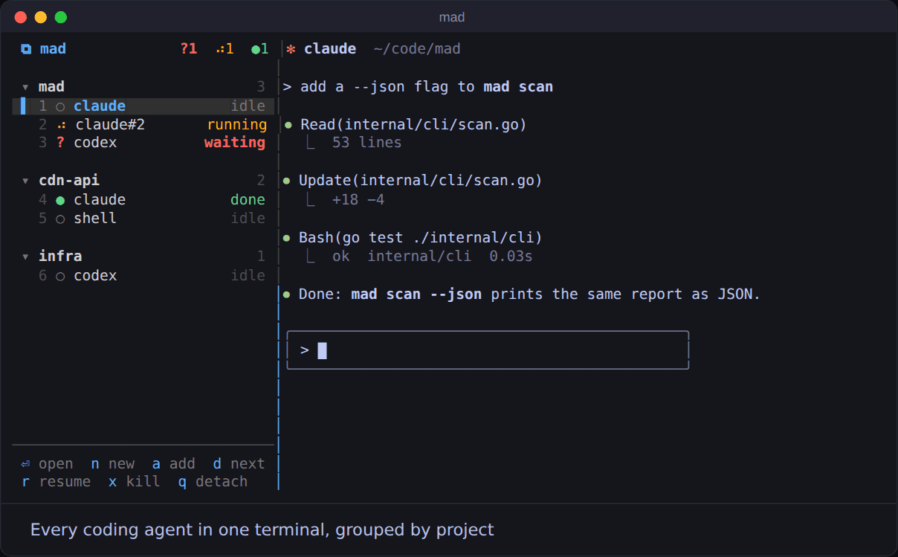

# mad — multi-agent deck

[](https://github.com/dcyber-lab/mad/actions/workflows/ci.yml)
[](LICENSE)

Run many coding-agent TUIs (Claude Code, Codex, pi, or a plain shell) side by
side in one terminal, organized by project. A project sidebar stays on the
left; the selected agent's real TUI fills the right.



<sub>Recorded from a real deck with real git repositories; the agents are
scripted stand-ins that report status and write transcripts the way claude
and codex do. [docs/demo](docs/demo) re-records it.</sub>

## Features

- **Project-first layout** — agents are grouped under the git project they
  work on; worktrees are folded into their main repository.
- **Live status** — each agent shows `running`, `waiting` (needs your input),
  `idle`, or `done` (finished while you were looking elsewhere).
- **Git at a glance** — every project and worktree shows its branch, how
  many files changed and how many commits are unpushed.
- **What each agent is on** — a claude or codex agent is listed by its
  conversation's title, with the tool it is calling or the prompt it was
  given under it. `t` gives it a name of your own.
- **Tokens at a glance** — every claude and codex agent shows what its
  session has consumed so far, and every project the sum of its agents.
- **One agent per branch** — `w` creates a git worktree on a new branch and
  starts an agent in it; `v` opens the changes of any agent in lazygit (or
  `git diff`) without leaving the deck; `f` pushes the branch, opens a pull
  request, or rebases / merges it onto the default branch.
- **Notifications** — a desktop notification when an agent finishes or needs
  you, and `d` / `Alt-n` to jump to the next one.
- **Never lose a session** — agents are started with a known session id, so
  after a crash or reboot you press `enter` and the conversation resumes.
- **Auto-sync** — Claude/Codex sessions running in other terminals or in the
  Claude desktop app are discovered and can be taken over or reopened.
- **Non-invasive** — uses its own private tmux server and never touches your
  `~/.claude/settings.json` or your own tmux config; what the sidebar shows
  about a conversation is read from the transcripts the agents already write.
- **Extensible** — add any other TUI agent with a few lines of JSON.

## Requirements

- macOS or Linux (developed and tested on macOS)
- [tmux](https://github.com/tmux/tmux) — 3.2+ recommended (see
  [Known limitations](#known-limitations))
- Go 1.24+ only if you build from source (older Go links macOS binaries
  that recent macOS refuses to load); the release binaries need no Go
- At least one agent CLI on your `PATH`:
  [`claude`](https://docs.anthropic.com/en/docs/claude-code),
  [`codex`](https://github.com/openai/codex), `pi`, …
- `ps` and `lsof` (used by auto-sync)

## Installation

With [Homebrew](https://brew.sh) (macOS or Linux):

```sh
brew install dcyber-lab/tap/mad
```

Prebuilt binaries for macOS and Linux (amd64 and arm64) are also on the
[releases page](https://github.com/dcyber-lab/mad/releases). To install the
latest one into `~/.local/bin`:

```sh
curl -fsSL https://github.com/dcyber-lab/mad/releases/latest/download/mad_$(uname -s | tr A-Z a-z)_$(uname -m | sed 's/x86_64/amd64/;s/aarch64/arm64/').tar.gz \
  | tar -xz -C ~/.local/bin mad
```

(`mkdir -p ~/.local/bin` first if it doesn't exist, and make sure it's on
your `PATH`.)

With Go 1.24 or newer installed:

```sh
go install github.com/dcyber-lab/mad@latest
```

or from source:

```sh
git clone https://github.com/dcyber-lab/mad.git
cd mad
make install          # → ~/.local/bin/mad (override with BIN=...)
```

`mad version` prints which build you have.

## Quick start

```sh
cd path/to/some/git/project
mad                   # opens the deck and adds the current project
```

Press `n` to start an agent, `enter` to show it, `Alt-s` to jump between the
sidebar and the agent, and `q` to detach (agents keep running). Run `mad`
again to reattach. For parallel work, `w` starts an agent on a branch of its
own, `v` shows what it changed, and `f` merges or pushes the branch when it
is done.

## Key bindings

### Sidebar

| Key            | Action                                         |
| -------------- | ---------------------------------------------- |
| `j` / `k`      | Move down / up                                 |
| `g` / `G`      | Top / bottom                                   |
| `enter`        | Open agent (or fold/unfold a project)          |
| `n`            | New agent in the current project               |
| `w`            | New agent in a new worktree (asks for a branch) |
| `v`            | Show / hide the changes of the agent or project |
| `f`            | Finish the branch: push, open a PR, rebase, merge |
| `a`            | Add a project                                  |
| `d`            | Jump to the next agent that is waiting or done |
| `r`            | Restart or resume the agent                    |
| `t`            | Name the agent (empty to go back to its title) |
| `i`            | Show / hide the line under each agent          |
| `x`            | Remove                                         |
| `1`–`9`        | Open agent N                                   |
| `tab`          | Focus the agent pane                           |
| `<` / `>`      | Narrow / widen the sidebar                     |
| `q`            | Detach (agents keep running)                   |

The mouse works too: click rows, or drag the divider to resize. The sidebar
width is remembered.

### Global

| Key               | Action                                     |
| ----------------- | ------------------------------------------ |
| `Alt-s`           | Toggle focus between sidebar and agent     |
| `Alt-j` / `Alt-k` | Next / previous agent                      |
| `Alt-n`           | Next agent that is waiting or done         |
| `Alt-v`           | Changes of the agent on stage, and back    |
| `Alt-1`…`Alt-9`   | Open agent N                               |

If Alt is inconvenient, use the prefix `Ctrl-]` followed by
`s` / `n` / `p` / `v` / `1`–`9` / `d` (detach).

> **Ghostty users:** set `macos-option-as-alt = true` so Option works as Alt.

## Commands

```
mad                     open the deck (adds the current git project)
mad add [path]          add a project (default: current directory)
mad switch N|next|prev  show agent N (1-based, sidebar order)
mad jump                show the next agent that is waiting or done
mad diff                show the changes of the agent on stage, and back
mad scan [path]         show what auto-sync sees (useful for debugging)
mad kill-server         stop the deck and every agent in it
mad version             print the version
```

## Syncing existing projects and sessions

- **Auto-sync.** Every 5 seconds mad scans for agent sessions running
  elsewhere and adds their projects to the sidebar.
  - `↗ claude ttys005` — a claude/codex process running in another terminal.
    Press `enter` to take it over: after confirmation the original process
    exits and the same session continues inside the deck.
  - `◇ N in desktop` — sessions currently open in the Claude desktop app.
    Press `enter` to see the list.
  - Projects you remove manually are never re-added automatically.
- **`a` — add project.** Opens a picker listing projects used by Claude/Codex
  (CLI and desktop) in the last 60 days, most recent first; `●` marks projects
  with a live session. Type to fuzzy-search, or start with `/` or `~` to
  switch to path completion (`tab` descends into a directory).
- **`n` — new claude/codex.** Shows the project's session history: start a
  new session or continue an old one (titles match the desktop app; `◇` marks
  desktop sessions). If that session is open elsewhere, claude forks it with
  `--fork-session`; codex asks you to close the other one first.
- Sessions started programmatically (desktop workflows, `-p`/SDK calls, codex
  sub-tasks) are filtered out.

## Reading the sidebar

An agent's row starts with its kind (`✻` claude, `>_` codex, `π` pi, `$`
shell; custom kinds set `icon` and `color` in `agents.json` or get their
initial) and is named after its conversation: the title you set with `/rename` (claude)
or in the app (codex), else the one claude generated, else the first thing
you asked, else just `claude`, `claude#2`. `t` on an agent sets a name of
your own instead, kept until you clear it. The line under a claude or codex
agent says what it is on: the tool being called and what it was pointed at
while it runs or waits (`Bash · go test ./...`, `Edit · main.go`),
otherwise the prompt it is working on or was last given. `i` hides that
line everywhere, for a shorter list.

The number before an agent's status (`1.2M`, `340k`) is every token its
current session has sent through the model: input, cache reads and writes,
and output, added up. Names, the line underneath and tokens all come from
the transcript claude or codex writes (`~/.claude/projects`,
`~/.codex/sessions`), read from where the last poll stopped, so agents are
never asked. A project row shows the sum of its
agents. `/clear` starts a new session, so the count starts over.

Every project row shows the branch of the main checkout, `±N` for files
changed or untracked, and `↑N` for commits not on the upstream; agents in
their own worktree show the same for theirs. The scan runs every 5 seconds
and right after an agent finishes a turn.

## Worktrees, diffs and finishing a branch

Parallel agents want parallel branches. On a project or one of its agents,
press `w`, type a branch name, and pick the agent kind: mad runs
`git worktree add` (creating the branch from `HEAD` unless it exists) and
starts the agent in the new checkout. Worktrees live in
`<project>/.claude/worktrees/<branch>`, the directory Claude Code uses for
its own, so sessions found there are grouped under the main repository
either way; mad adds it to `.git/info/exclude` so it never shows up as
untracked. The agent's row names its branch; `x` on the last agent in a
worktree offers to remove the worktree too (the branch is kept, and a
worktree with uncommitted changes is refused).

`v` on an agent or project (or `Alt-v` from the agent's pane) swaps the
stage to a viewer for its changes: [lazygit](https://github.com/jesseduffield/lazygit)
when installed, else `git status` and `git diff HEAD` in `less`. Quit the
viewer, press `v` / `Alt-v` again, or open any agent, and it goes away.
Pick your own viewer in `~/.config/mad/config.json`; `{dir}` is the
directory, already shell-quoted:

```json
{"diff": {"command": "tig -C {dir} status"}}
```

When the branch is done, `f` on the agent (or project) lists what can
happen to it: push and open a pull request (`gh pr create`, when `gh` is
installed), rebase onto the default branch, merge into it (offered when the
main checkout has the default branch out), or just push. The default
branch is what `origin/HEAD` points at, else `main` or `master`. The
command runs on stage in the checkout and stays until you press enter, so
a PR link or a conflict can be read; the sidebar's git counts refresh
right after. Your own list in `config.json` replaces the built-in one;
`{dir}`, `{repo}`, `{branch}` and `{base}` are filled in, shell-quoted:

```json
{"finish": [{"name": "open PR", "command": "gh pr create --web --base {base}"},
            {"name": "squash onto {base}", "command": "git rebase -i {base}"}]}
```

## How it works

- mad runs a **private tmux server** (`tmux -L mad`), isolated from any tmux
  you already use.
- The `main` session has a single window with two panes: the **sidebar**
  (left) and the **stage** (right).
- Every agent lives in its own window inside a hidden `_pool` session.
  Switching agents `swap-pane`s the agent into the stage, so the sidebar is
  always there.
- **Status detection**
  - *claude*: hooks are injected with `--settings` (your own settings file is
    untouched) and report running / waiting (permission prompts, questions) /
    idle.
  - *codex*: running/idle is inferred from screen changes, waiting from
    on-screen text. `-c notify=...` reports the thread id so resume reopens
    the right conversation; if your `~/.codex/config.toml` (or
    `$CODEX_HOME`) sets `notify` itself, mad leaves yours alone and resume
    falls back to `codex resume --last`.
  - Agents that finish in the background show a green `● done` until you
    look at them.
  - Updates are pushed where possible: a hook report reaches the sidebar
    over a socket as it happens, and so does an agent's process ending
    (tmux's `pane-died`, on mad's own server). Agents without hooks have
    their screens read twice a second, and everything is re-read every 3
    seconds in case an event got lost. Nothing beyond the launch flags above
    is asked of the agents.
- **Resume**: claude and pi are started with `--session-id <agent uuid>`;
  for codex the thread id is recorded. If tmux dies or the machine restarts,
  press `enter` on the agent to resume the same conversation.

## Notifications

When an agent finishes a run (running → idle) or starts waiting for you,
mad shows a desktop notification: `osascript` on macOS, `notify-send` on
Linux. Nothing is sent for the agent on stage while its terminal has focus,
for runs shorter than 5 seconds, or twice for the same agent and event
within 15 seconds. They keep coming while the deck is detached.

Configure them in `~/.config/mad/config.json`:

```json
{"notify": {"on": ["done", "waiting"], "command": ""}}
```

| Field     | Meaning                                                                 |
| --------- | ----------------------------------------------------------------------- |
| `on`      | Events to notify about: `done`, `waiting`. `[]` turns notifications off |
| `command` | Run through `sh` instead of the desktop notification                    |

The command gets `MAD_EVENT`, `MAD_PROJECT`, `MAD_AGENT`, `MAD_TITLE` and
`MAD_MESSAGE` in its environment, e.g. `terminal-notifier -title
"$MAD_TITLE" -message "$MAD_MESSAGE"`, or a curl to ntfy.sh for your phone.
Changes to the file apply right away.

## Custom agents

Create `~/.config/mad/agents.json`. Entries are merged with the built-in
definitions by `name`, so you can add new agents or override existing ones:

```json
[
  {"name": "gemini", "start": "gemini", "waiting": ["Allow execution"]},
  {"name": "claude",
   "start":  "claude --settings {claude_settings} --session-id {id} --model opus",
   "resume": "claude --settings {claude_settings} --resume {sid}",
   "hooks":  true}
]
```

| Field           | Meaning                                                           |
| --------------- | ----------------------------------------------------------------- |
| `name`          | Agent kind name shown in the sidebar                              |
| `icon`          | A glyph or two standing for the kind in the sidebar (default: initial) |
| `color`         | The icon's color: an xterm-256 number or `#rrggbb`                |
| `start`         | Shell command for a fresh session                                 |
| `resume`        | Command to reopen session `{sid}`                                 |
| `resume_latest` | Command to reopen the most recent session when no id is known     |
| `waiting`       | Regexes matched against the bottom of the screen → `waiting`      |
| `hooks`         | The agent reports status itself through `mad hook`                |

Placeholders: `{id}` (agent UUID), `{sid}` (current session id, falls back
to `{id}`), `{claude_settings}` (mad's generated Claude settings with status
hooks), `{codex_notify}` (codex notify wiring; empty when your codex config
sets its own `notify`).

## Files

| Path                                  | Contents                                          |
| ------------------------------------- | ------------------------------------------------- |
| `~/.config/mad/tmux.conf`             | Generated tmux config (rewritten on every start)  |
| `~/.config/mad/claude-settings.json`  | Generated Claude hook settings                    |
| `~/.config/mad/agents.json`           | Optional custom agent definitions                 |
| `~/.config/mad/config.json`           | Optional settings (notifications, diff viewer, finish menu) |
| `~/.local/state/mad/state.json`       | Projects and agents                               |
| `~/.local/state/mad/status/`          | Status reported by hooks                          |
| `~/.local/state/mad/sidebar_width`    | Saved sidebar width                               |
| `~/.local/state/mad/sidebar.log`      | Sidebar crash log (the sidebar auto-restarts)     |
| `~/.local/state/mad/sidebar-mad.sock` | How `mad hook`, `switch`, `jump` and `diff` reach the sidebar |

`XDG_CONFIG_HOME` and `XDG_STATE_HOME` are respected.

## Known limitations

- tmux older than 3.2 lacks `extended-keys`, so Shift+Enter for a newline in
  claude does not work there (use `\` + Enter instead). On macOS, upgrade
  with `brew upgrade tmux`.
- codex and pi have no hooks, so their `waiting` state relies on matching
  on-screen text and may miss new prompt wording. Their `running` state comes
  from screen changes: a long command that prints nothing can briefly look
  idle.
- The Claude desktop app doesn't expose which session a process serves; mad
  picks the newest session in that process's directory. This is exact when
  each conversation has its own directory (the app's default worktrees).
- Desktop-app discovery is macOS only; everything else also works on Linux.
- Titles, the line under each agent and token counts come from the
  transcripts claude and codex write, a format neither documents. An agent
  update can change it; the sidebar then falls back to `claude`, `claude#2`
  and shows no counts until mad catches up. They refresh every 5 seconds
  and when a turn ends, so they can trail the status a little.

## Contributing

Issues and pull requests are welcome — see [CONTRIBUTING.md](CONTRIBUTING.md).

## License

[MIT](LICENSE)
