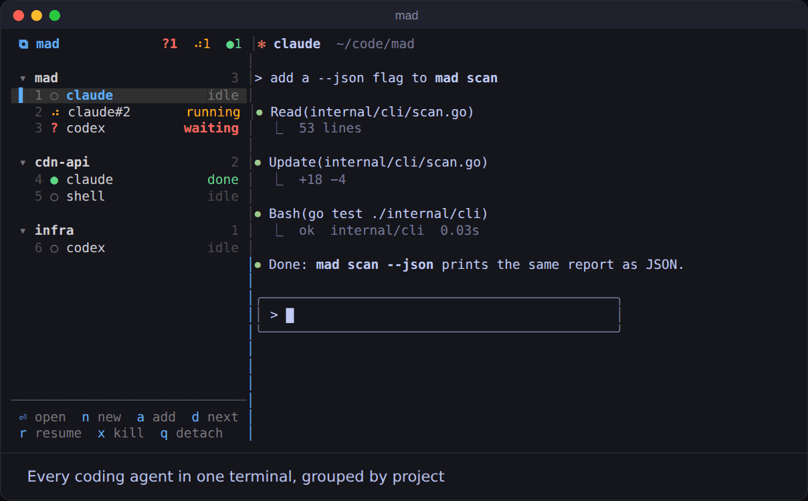

# mad — multi-agent deck

[](https://github.com/dcyber-lab/mad/actions/workflows/ci.yml)
[](LICENSE)

Run many coding-agent TUIs (Claude Code, Codex, pi, or a plain shell) side by
side in one terminal, organized by project. A project sidebar stays on the
left; the selected agent's real TUI fills the right.



<sub>Recorded from a real deck with real git repositories; the agents are
scripted stand-ins that report status and write transcripts the way claude
and codex do. [docs/demo](docs/demo) re-records it.</sub>

## Features

- **Project-first layout** — agents are grouped under the git project they
  work on; worktrees are folded into their main repository.
- **Live status** — each agent shows `running`, `waiting` (needs your input),
  `idle`, `done` (finished while you were looking elsewhere), or `asleep`.
- **Git at a glance** — every project and worktree shows its branch, how
  many files changed and how many commits are unpushed.
- **What each agent is on** — a claude or codex agent is listed by its
  conversation's title, with the tool it is calling or the prompt it was
  given under it. `t` gives it a name of your own.
- **Cost at a glance** — every claude agent shows what its session has
  cost so far at API prices (codex: tokens), every project the sum of its
  agents, and the header what all of today's claude sessions cost.
- **Usage limits** — under the header, how much of the claude and codex
  subscription windows (5-hour, weekly) is used and when they reset.
- **One agent per branch** — `w` creates a git worktree on a new branch and
  starts an agent in it; `v` opens the changes of any agent in lazygit (or
  `git diff`) without leaving the deck; `f` pushes the branch, opens a pull
  request, or rebases / merges it onto the default branch.
- **Notifications** — a desktop notification when an agent finishes or needs
  you, and `d` / `Alt-n` to jump to the next one.
- **Never lose a session** — agents are started with a known session id, so
  after a crash or reboot you press `enter` and the conversation resumes.
- **Sleep when idle** — optionally, agents left idle for a while give their
  memory back and resume when you open them.
- **Auto-sync** — Claude/Codex sessions running in other terminals or in the
  Claude desktop app are discovered and can be taken over or reopened.
- **Non-invasive** — uses its own private tmux server and never touches your
  `~/.claude/settings.json` or your own tmux config; what the sidebar shows
  about a conversation is read from the transcripts the agents already write.
- **Runs** — `o` hands a task to agents in roles: claude on Opus designs,
  claude on Sonnet implements, codex reviews and sends the work back until
  it passes. The run waits for you only when something needs you, and
  says what.
- **Hand work between agents** — `mad spawn`, `mad send` and `mad wait`
  let a script, or an agent, start agents of any kind, give them work and
  pass their answers on.
- **Extensible** — add any other TUI agent with a few lines of JSON.

## Requirements

- macOS or Linux (developed and tested on macOS)
- [tmux](https://github.com/tmux/tmux) 3.0 or newer — 3.2+ recommended (see
  [Known limitations](#known-limitations))
- Go 1.24+ only if you build from source (older Go links macOS binaries
  that recent macOS refuses to load); the release binaries need no Go
- At least one agent CLI on your `PATH`:
  [`claude`](https://docs.anthropic.com/en/docs/claude-code),
  [`codex`](https://github.com/openai/codex), `pi`, …
- `ps` and `lsof` (used by auto-sync)

## Installation

One line installs mad and what it needs:

```sh
curl -fsSL https://raw.githubusercontent.com/dcyber-lab/mad/main/install.sh | sh
```

The latest release goes to `~/.local/bin`, checked against the release's
checksums. tmux, git, `ps` and `lsof` are installed with your package
manager (Homebrew, apt, dnf, yum, pacman, zypper or apk) when they are
missing, and left alone when they are there. On macOS it also installs
`terminal-notifier` for notifications (with brew, or the release app where
brew can't). The agents are yours to install.

| Option          | Meaning                                                      |
| --------------- | ------------------------------------------------------------ |
| `--all`         | Also lazygit, `gh` and, on Linux, `notify-send`              |
| `--no-deps`     | Only mad, no packages                                        |
| `--dir DIR`     | Where mad goes (default: `~/.local/bin`)                     |
| `--version TAG` | A release such as `v0.2.0` (default: the latest)             |
| `--dry-run`     | Say what would be done, change nothing                       |

Options follow `sh -s --`, as in `curl ... | sh -s -- --all`.

With [Homebrew](https://brew.sh) (macOS or Linux):

```sh
brew install dcyber-lab/tap/mad
```

Prebuilt binaries for macOS and Linux (amd64 and arm64) are also on the
[releases page](https://github.com/dcyber-lab/mad/releases). To install the
latest one into `~/.local/bin`:

```sh
curl -fsSL https://github.com/dcyber-lab/mad/releases/latest/download/mad_$(uname -s | tr A-Z a-z)_$(uname -m | sed 's/x86_64/amd64/;s/aarch64/arm64/').tar.gz \
  | tar -xz -C ~/.local/bin mad
```

(`mkdir -p ~/.local/bin` first if it doesn't exist, and make sure it's on
your `PATH`.)

With Go 1.24 or newer installed:

```sh
go install github.com/dcyber-lab/mad@latest
```

or from source:

```sh
git clone https://github.com/dcyber-lab/mad.git
cd mad
make install          # → ~/.local/bin/mad (override with BIN=...)
```

`mad version` prints which build you have.

## Quick start

```sh
cd path/to/some/git/project
mad                   # opens the deck and adds the current project
```

Press `n` to start an agent, `enter` to show it, `Alt-s` to jump between the
sidebar and the agent, and `q` to detach (agents keep running). Run `mad`
again to reattach. For parallel work, `w` starts an agent on a branch of its
own, `v` shows what it changed, and `f` merges or pushes the branch when it
is done.

## Key bindings

### Sidebar

| Key            | Action                                         |
| -------------- | ---------------------------------------------- |
| `j` / `k`      | Move down / up                                 |
| `g` / `G`      | Top / bottom                                   |
| `enter`        | Open agent (or fold/unfold a project)          |
| `n`            | New agent in the current project               |
| `w`            | New agent in a new worktree (asks for a branch) |
| `o`            | New run: a task handed through agents in roles |
| `c`            | Continue the run where it waits for you        |
| `m`            | Leave a note every role of the run hears       |
| `v`            | Show / hide the changes of the agent or project |
| `f`            | Finish the branch: push, open a PR, rebase, merge |
| `a`            | Add a project                                  |
| `d`            | Jump to the next agent that is waiting or done |
| `r`            | Restart or resume the agent                    |
| `z`            | Put the agent to sleep (opening it resumes it) |
| `t`            | Name the agent (empty to go back to its title) |
| `i`            | Show / hide the line under each agent          |
| `x`            | Remove                                         |
| `1`–`9`        | Open agent N of the run or project the cursor is in |
| `tab`          | Focus the agent pane                           |
| `<` / `>`      | Narrow / widen the sidebar                     |
| `q`            | Detach (agents keep running)                   |

The mouse works too: click rows, or drag the divider to resize. The sidebar
width is remembered.

### Global

| Key               | Action                                     |
| ----------------- | ------------------------------------------ |
| `Alt-s`           | Toggle focus between sidebar and agent     |
| `Alt-j` / `Alt-k` | Next / previous agent                      |
| `Alt-n`           | Next agent that is waiting or done         |
| `Alt-v`           | Changes of the agent on stage, and back    |
| `Alt-1`…`Alt-9`   | Open agent N of the run or project on stage |

If Alt is inconvenient, use the prefix `Ctrl-]` followed by
`s` / `n` / `p` / `v` / `1`–`9` / `d` (detach).

> **Ghostty users:** set `macos-option-as-alt = true` so Option works as Alt.

## Commands

```
mad                     open the deck (adds the current git project)
mad add [path]          add a project (default: current directory)
mad switch N|next|prev  show agent N of the project on stage, or the next /
                        previous agent
mad jump                show the next agent that is waiting or done
mad diff                show the changes of the agent on stage, and back
mad scan [path]         show what auto-sync sees (useful for debugging)
mad ls                  list the agents: id, name, kind, status, directory
mad spawn [flags] [-- agent flags]
                        start an agent off stage and print its id
mad send [-w] AGENT TEXT
                        type a message into an agent; -w prints its reply
mad wait AGENT          wait for the agent's turn to end, print its reply
mad kill-server         stop the deck and every agent in it
mad version             print the version
```

## Syncing existing projects and sessions

- **Auto-sync.** Every 5 seconds mad scans for agent sessions running
  elsewhere and adds their projects to the sidebar.
  - `↗ claude ttys005` — a claude/codex process running in another terminal.
    Press `enter` to take it over: after confirmation the original process
    exits and the same session continues inside the deck.
  - `◇ N in desktop` — sessions currently open in the Claude desktop app.
    Press `enter` to see the list.
  - Projects you remove manually are never re-added automatically.
- **`a` — add project.** Opens a picker listing projects used by Claude/Codex
  (CLI and desktop) in the last 60 days, most recent first; `●` marks projects
  with a live session. Type to fuzzy-search, or start with `/` or `~` to
  switch to path completion: `tab` completes like a shell (the part all
  matches share, then the whole name), or descends into the selected one.
- **`n` — new claude/codex.** Shows the project's session history: start a
  new session or continue an old one (titles match the desktop app; `◇` marks
  desktop sessions). If that session is open elsewhere, claude forks it with
  `--fork-session`; codex asks you to close the other one first.
- Sessions started programmatically (desktop workflows, `-p`/SDK calls, codex
  sub-tasks) are filtered out.

## Reading the sidebar

An agent's row starts with its kind (`✻` claude, `>_` codex, `π` pi, `$`
shell; custom kinds set `icon` and `color` in `agents.json` or get their
initial) and is named after its conversation: the title you set with `/rename` (claude)
or in the app (codex), else the one claude generated, else the first thing
you asked, else just `claude`, `claude#2`. `t` on an agent sets a name of
your own instead, kept until you clear it. The line under a claude or codex
agent says what it is on: the tool being called and what it was pointed at
while it runs or waits (`Bash · go test ./...`, `Edit · main.go`),
otherwise the prompt it is working on or was last given. `i` hides that
line everywhere, for a shorter list.

The amount before a claude agent's status (`$1.23`) is what its current
session, subagents included, would cost at Anthropic's API list prices:
input, cache writes (five-minute and one-hour), cache reads and output,
each at its model's rate, doubled in fast mode, plus web searches. It is
an estimate like claude's own `/cost`; on a subscription nothing is billed
per token. Codex models have no price in mad, so a codex agent shows every
token its session sent through the model instead (`1.2M`, `340k`). Names,
the line underneath and usage all come from the transcript claude or codex
writes (`~/.claude/projects`, `~/.codex/sessions`), read from where the
last poll stopped, so agents are never asked. A project row shows the sum
of its agents (`$4.10 + 1.2M` when it has both). `/clear` starts a new
session, so the count starts over.

The header adds up today at the same prices (`today $158`): every claude
response logged since local midnight, in any session on the machine
(the deck's, other terminals', the desktop app's, subagents), each counted
once. Runs that keep no transcript (`claude -p --no-session-persistence`)
are not in it. It is left out when the sidebar is too narrow to show it
whole.

Every project row shows the branch of the main checkout, `±N` for files
changed or untracked, and `↑N` for commits not on the upstream; agents in
their own worktree show the same for theirs. The scan runs every 5 seconds
and right after an agent finishes a turn.

## Worktrees, diffs and finishing a branch

Parallel agents want parallel branches. On a project or one of its agents,
press `w`, type a branch name, and pick the agent kind: mad runs
`git worktree add` (creating the branch from `HEAD` unless it exists) and
starts the agent in the new checkout. Worktrees live in
`<project>/.claude/worktrees/<branch>`, the directory Claude Code uses for
its own, so sessions found there are grouped under the main repository
either way; mad adds it to `.git/info/exclude` so it never shows up as
untracked. The agent's row names its branch; `x` on the last agent in a
worktree offers to remove the worktree too (the branch is kept, and a
worktree with uncommitted changes is refused).

`v` on an agent or project (or `Alt-v` from the agent's pane) swaps the
stage to a viewer for its changes: [lazygit](https://github.com/jesseduffield/lazygit)
when installed, else `git status` and `git diff HEAD` in `less`. Quit the
viewer, press `v` / `Alt-v` again, or open any agent, and it goes away.
Pick your own viewer in `~/.config/mad/config.json`; `{dir}` is the
directory, already shell-quoted:

```json
{"diff": {"command": "tig -C {dir} status"}}
```

When the branch is done, `f` on the agent (or project) lists what can
happen to it: push and open a pull request (`gh pr create`, when `gh` is
installed), rebase onto the default branch, merge into it (offered when the
main checkout has the default branch out), or just push. The default
branch is what `origin/HEAD` points at, else `main` or `master`. The
command runs on stage in the checkout and stays until you press enter, so
a PR link or a conflict can be read; the sidebar's git counts refresh
right after. Your own list in `config.json` replaces the built-in one;
`{dir}`, `{repo}`, `{branch}` and `{base}` are filled in, shell-quoted:

```json
{"finish": [{"name": "open PR", "command": "gh pr create --web --base {base}"},
            {"name": "squash onto {base}", "command": "git rebase -i {base}"}]}
```

## Usage limits

On a claude.ai or ChatGPT subscription, a line per kind under the header
shows how much of the plan is used:

```
 ✻  5h ▓▓▓▓▓░░░ 62% 2h10m          wk 31% 3d4h
 >_ 5h ▓░░░░░░░ 12% 4h02m          wk 40% 5d
```

The bar and the first percentage are the rolling five-hour window with the
time until it resets; `wk` is the weekly one. Orange from 80%, red from
95%. A window whose reset has passed reads as 0% until the next report.
Nothing is shown on an API key or a gateway without limits.

claude reports its limits to a status line command mad passes in with
`--settings` (Claude Code v2.1.211 or later): `mad hook claude statusline`
records them, then runs the status line from your own settings with the
same input, so yours still shows. Without one it prints `Opus · ctx 34% ·
5h 62% (2h10m) · wk 31%`. codex writes its limits into its rollout after
every response, which mad reads anyway. Agents started before mad learned
this keep running without it; resume them (`r`) to pick it up. Turn the
whole thing off with `{"quota": false}` in `config.json`.

## How it works

- mad runs a **private tmux server** (`tmux -L mad`), isolated from any tmux
  you already use.
- The `main` session has a single window with two panes: the **sidebar**
  (left) and the **stage** (right).
- Every agent lives in its own window inside a hidden `_pool` session.
  Switching agents `swap-pane`s the agent into the stage, so the sidebar is
  always there.
- **Status detection**
  - *claude*: hooks are injected with `--settings` (your own settings file is
    untouched) and report running / waiting (permission prompts, questions) /
    idle.
  - *codex*: running/idle is inferred from screen changes, waiting from
    on-screen text. `-c notify=...` reports the end of every turn, with the
    thread id so resume reopens the right conversation. A `notify` of your
    own in `~/.codex/config.toml` (or `$CODEX_HOME`) is run after mad's
    with the same payload, so it keeps working. One set only in a profile,
    or written in a way mad doesn't read, is left alone instead: resume
    then falls back to `codex resume --last`, and `mad wait` can't tell
    when codex is done.
  - Agents that finish in the background show a green `● done` until you
    look at them.
  - Updates are pushed where possible: a hook report reaches the sidebar
    over a socket as it happens, and so does an agent's process ending
    (tmux's `pane-died`, on mad's own server). Agents without hooks have
    their screens read twice a second, and everything is re-read every 3
    seconds in case an event got lost. Nothing beyond the launch flags above
    is asked of the agents.
- **Resume**: claude and pi are started with `--session-id <agent uuid>`;
  for codex the thread id is recorded. If tmux dies or the machine restarts,
  press `enter` on the agent to resume the same conversation.

## Notifications

When an agent finishes a run (running → idle) or starts waiting for you,
mad shows a desktop notification: `terminal-notifier` on macOS, and
`osascript` when it isn't installed (clicking one of those opens Script
Editor, not the terminal); `notify-send` on Linux. Nothing is sent for the
agent on stage while its terminal has focus, for runs shorter than 5
seconds, or twice for the same agent and event within 15 seconds. They
keep coming while the deck is detached.

Configure them in `~/.config/mad/config.json`:

```json
{"notify": {"on": ["done", "waiting"], "command": ""}}
```

| Field     | Meaning                                                                 |
| --------- | ----------------------------------------------------------------------- |
| `on`      | Events to notify about: `done`, `waiting`. `[]` turns notifications off |
| `command` | Run through `sh` instead of the desktop notification                    |

The command gets `MAD_EVENT`, `MAD_PROJECT`, `MAD_AGENT`, `MAD_TITLE` and
`MAD_MESSAGE` in its environment, e.g. a curl to ntfy.sh for your phone.
Changes to the file apply right away. A mistake in it (a stray comma) is
shown at the bottom of the sidebar with its line, and the last good
settings stay in effect until it's fixed.

## Sleeping idle agents

Every agent in the deck is a live process: an idle claude holds a few hundred
MB whether or not you come back to it. With `sleep` set in
`~/.config/mad/config.json`, mad ends the process of an agent that has sat
idle off stage for that long; it shows `◌ asleep`, and opening it (`enter`,
`d`, `Alt-j`, `mad switch`) resumes the same conversation in a few seconds.
`z` puts the selected agent to sleep at once.

```json
{"sleep": {"after": "60m"}}
```

Off unless set. Only agents whose kind can resume a session (`resume` in
`agents.json`: claude and codex) are put to sleep, and never while running,
waiting for you or on stage. One that finished while you were elsewhere
stays `● done` while asleep.

- **Background work keeps an agent awake.** A shell anywhere under the
  agent's process (a command it runs, a background task, an MCP server
  started through `sh -c`) means it is busy; `z` says so.
- **What only the process held is lost:** text typed into the prompt but
  not sent, and whatever else the agent keeps in memory rather than in its
  transcript. Resuming reads the transcript back.
- **60 minutes or more is cheapest.** The model's prompt cache lasts up to
  an hour; a conversation resumed sooner than that can miss it and pay for
  its whole context again on the next message.

## Runs

A run hands one task through agents in roles, in a worktree of its own.
Press `o` on a project, write the task in one line and press enter:

1. **Design.** claude on Opus reads the code and writes
   `.mad/runs/<name>/design.md`.
2. **Implement.** claude on Sonnet implements it, runs the tests and
   commits. If the design leaves something open, it asks the designer
   (`QUESTION(@designer): ...`), and the answer comes back to it.
3. **Review.** codex, read only, reviews `git diff` against the design and
   ends with `VERDICT: APPROVE` or `VERDICT: CHANGES`. Changes go back to
   the same implementer, at most three rounds.

The form also picks who plays each role (←→: claude on Opus, Sonnet or
Haiku, codex with the model its config sets, or any model codex lists
for your account), how hard each thinks (its effort: claude's `low` to
`max`, or the levels codex lists for the model; `default` leaves it to
the agent's own setting) and what claude agents may do unasked: `auto` (claude
judges each action, and asks only about risky ones; the default),
`allowlist` (edits, and test, build and commit commands) or `bypass`
(everything). codex works in its sandbox, read only as a reviewer; a
claude reviewer may not edit.

The run is a row in the sidebar with its three agents under it, numbered
1–3 within it; `enter` on it folds or unfolds them, and shows its panel
on stage: each step, what it came to, what it cost,
each role's context and the log. Every agent is a real TUI: `enter` on
one to watch it or step in.

A run never waits silently. When it needs you (a permission prompt, a
folder to trust, a review out of rounds, the budget spent, a turn that
ended without a reply) its row says why, you get one notification, and
it goes on by itself once that is settled, or when you press `c`. `x`
cancels a run, and removes one that is over; its branch stays. When it
is done, `f` on it opens a pull request or merges the branch.

What you type into a role's agent counts for the whole run: the other
roles hear it with their next step, as a note from you that holds over
the task where they differ. `m` on a run leaves a note without picking an
agent (`mad run note NAME TEXT` from a shell). mad never types over a
message you have started in an agent; it waits until you send or clear
it.

Every role works in the run's worktree alone:

- codex's sandbox lets it write there, and to the repository's git data
  its commits need; nowhere else.
- A claude role's hook refuses an edit outside the worktree, and a shell
  command that names the main checkout. claude is told why, and carries
  on in the worktree, whatever the permission mode.
- A command can still reach further in ways no hook sees, so after each
  step mad looks at the main checkout, and the run's log says when it
  changed.

Hand-over is through files, not conversations, so each role reads only
its part. A claude role whose context passes 150k tokens is compacted
before its next step; a run stops for you at $10 of claude, or when an
account's five-hour window is 90% spent. The runner of a run is a hidden
pane (`mad run exec`), which picks the run up where it stopped after a
crash or a rebuilt deck. `mad run start TASK` starts a run without the
form (`--agent builder=codex:gpt-6-sol@xhigh`, `--perm allowlist`); `mad run ls`,
`continue` and `cancel` do the rest.

### Flows

A flow is a run's template: its roles, who plays each, and its steps. mad
comes with two (`design-impl-review`, the default, and `impl-review`);
more are JSON files in a project's `.mad/flows/` (shared with whoever
clones it) or in `~/.config/mad/flows/` (yours), and one named as an
existing flow takes its place. The form lists them all.

```sh
mad run flow ls                         # the flows here, and where each is from
mad run flow show design-impl-review    # a flow as JSON: a start for your own
mad run flow check .mad/flows/mine.json # what is wrong with a flow file
mad run flow agents                     # the agents and efforts a role can have
```

A step says only what to do; mad adds how to end the reply (`DONE`,
`VERDICT: ...`, `QUESTION(@role): ...`). Steps run one at a time; a
review sends its changes back to an earlier step. A run keeps the flow it
started with, whatever becomes of the file.

You need not write flows yourself: `mad skill install` puts the
`mad-flow` skill in `~/.claude/skills/`, and claude then designs a flow
with you from what you describe ("opus designs, codex implements, two
reviews"), writes the file, and checks it until mad takes it.

## Handing work between agents

`mad spawn`, `mad send` and `mad wait` put agents to work from a script,
or from another agent's shell, and hand their answers on. Here claude on
Opus designs, claude on Sonnet implements and codex reviews, all in one
worktree, passing the design on in a file:

```sh
mad spawn -n architect -m opus   -w wordfreq -- --permission-mode acceptEdits
mad spawn -n builder   -m sonnet -w wordfreq -- --permission-mode acceptEdits
mad spawn -n reviewer  -k codex  -w wordfreq -- -s read-only -a never

mad send -w architect "Design a word-frequency CLI; write it to .mad/run/design.md"
mad send -w builder   "Implement .mad/run/design.md"
mad send -w reviewer  "Review the change against .mad/run/design.md; end with VERDICT: APPROVE or VERDICT: CHANGES"
```

- **`spawn`** starts an agent off stage (it is in the sidebar like any
  other) and returns once it can take a message. `-k` picks the kind
  (default claude), `-m` the model, `-C` the directory, and `-w` a worktree
  on that branch, as `w` in the sidebar; several agents can share one.
  What follows `--` is passed to the agent, on resume too. It prints the
  agent's id; `-n` gives it a name to use instead. One that comes up
  asking something (claude's folder trust, codex's update notice) exits 1
  saying so: answer it in the deck.
- **`send`** types the message in as one paste, then enter (`-f file` or
  `-` for stdin instead of text). An agent asleep or stopped is resumed
  first. One that is working, or waiting for your answer, is refused;
  right after claude reports a turn done, `send` gives it a minute to
  finish its own Stop hooks.
- **`wait`**, or `send -w`, waits for the turn to end and prints the
  agent's last message: claude's Stop hook and codex's notify hand it
  over. A permission prompt meanwhile is told on stderr, and waited
  through while you answer it in the deck. It exits 124 on a `-t`
  timeout, and 1 when the agent exits or the turn ends without a reply
  (interrupted, a tool call refused).

`mad ls` lists the agents with their ids, names and status. Agents are
found by id, by a unique start of it, or by name (the one in the current
project first). Give unattended agents the permissions they need (claude's
`--permission-mode` and `--allowedTools`, codex's `-s` and `-a`), and keep
your own typing out of an agent a script is driving: `send` types into the
same prompt.

## Custom agents

Create `~/.config/mad/agents.json`. Entries are merged with the built-in
definitions by `name`, so you can add new agents or override existing ones:

```json
[
  {"name": "gemini", "start": "gemini", "waiting": ["Allow execution"]},
  {"name": "claude",
   "start":  "claude --settings {claude_settings} --session-id {id} --model opus",
   "resume": "claude --settings {claude_settings} --resume {sid} --model opus"}
]
```

An override changes only the fields it sets; the rest stay as built in
(icon, waiting patterns, `fork`, `hooks` above). Set a field empty to drop
it: `"fork": ""`, `"waiting": []`. Like `config.json`, the file is reread
when it changes, and a mistake is shown in the sidebar: an entry that
can't be used is left out, a file that isn't valid JSON is ignored until
fixed.

| Field           | Meaning                                                           |
| --------------- | ----------------------------------------------------------------- |
| `name`          | Agent kind name shown in the sidebar                              |
| `icon`          | A glyph or two standing for the kind in the sidebar (default: initial) |
| `color`         | The icon's color: an xterm-256 number or `#rrggbb`                |
| `start`         | Shell command for a fresh session                                 |
| `resume`        | Command to reopen session `{sid}`                                 |
| `resume_latest` | Command to reopen the most recent session when no id is known     |
| `fork`          | Appended to `resume` to continue a session still open elsewhere in a copy (without it, close it there first) |
| `waiting`       | Regexes matched against the bottom of the screen → `waiting`      |
| `hooks`         | The agent reports status itself through `mad hook`                |

Placeholders: `{id}` (agent UUID), `{sid}` (current session id, falls back
to `{id}`), `{claude_settings}` (mad's generated Claude settings with status
hooks), `{codex_notify}` (codex notify wiring; empty when your codex config
sets a `notify` mad can't run for you).

Kinds added here start, resume and show `waiting` like the built-ins. What
mad reads from claude's and codex's own files (titles, usage, the session
picker, sessions open elsewhere) is Go code, one file per agent in
`internal/discover`; see [CONTRIBUTING](CONTRIBUTING.md#adding-an-agent).

## Files

| Path                                  | Contents                                          |
| ------------------------------------- | ------------------------------------------------- |
| `~/.config/mad/tmux.conf`             | Generated tmux config (rewritten on every start)  |
| `~/.config/mad/claude-settings.json`  | Generated Claude hook settings                    |
| `~/.config/mad/agents.json`           | Optional custom agent definitions                 |
| `~/.config/mad/config.json`           | Optional settings (notifications, diff viewer, finish menu, quota, sleep) |
| `~/.local/state/mad/state.json`       | Projects and agents                               |
| `~/.local/state/mad/status/`          | Status reported by hooks; `quota-<kind>.json` usage limits |
| `~/.local/state/mad/sidebar_width`    | Saved sidebar width                               |
| `~/.local/state/mad/sidebar.log`      | Sidebar crash log (the sidebar auto-restarts)     |
| `~/.local/state/mad/sidebar-mad.sock` | How `mad hook`, `switch`, `jump` and `diff` reach the sidebar |

`XDG_CONFIG_HOME` and `XDG_STATE_HOME` are respected. `MAD_SOCKET=name`
runs a deck of its own on that tmux server, such as a build tried next to
the mad you use: its state and the generated files go in
`~/.local/state/mad/decks/<name>/`, and only `config.json` and
`agents.json` are shared.

## Known limitations

- tmux older than 3.2 lacks `extended-keys`, so Shift+Enter for a newline in
  claude does not work there (use `\` + Enter instead). On macOS, upgrade
  with `brew upgrade tmux`.
- A running deck stays on the tmux it was started with. After a tmux
  upgrade, `mad` says so when the versions differ, and may fail to open the
  deck with `open terminal failed: not a terminal`. Run `mad kill-server`
  and then `mad`; that stops every agent, press `enter` on each to resume.
- codex and pi have no hooks, so their `waiting` state relies on matching
  on-screen text and may miss new prompt wording. Their `running` state comes
  from screen changes: a long command that prints nothing can briefly look
  idle.
- The Claude desktop app doesn't expose which session a process serves; mad
  picks the newest session in that process's directory. This is exact when
  each conversation has its own directory (the app's default worktrees).
- Desktop-app discovery is macOS only; everything else also works on Linux.
- Titles, the line under each agent and usage come from the
  transcripts claude and codex write, a format neither documents. An agent
  update can change it; the sidebar then falls back to `claude`, `claude#2`
  and shows no counts until mad catches up. They refresh every 5 seconds
  and when a turn ends, so they can trail the status a little.
- `mad wait` needs claude or codex: other kinds can be sent messages,
  but don't say when they are done.
- Claude prices are built into mad (`internal/discover/price.go`). A model
  released after it is priced like the latest of its family (Opus, Sonnet,
  Haiku, Fable) until mad is updated.

## Contributing

Issues and pull requests are welcome — see [CONTRIBUTING.md](CONTRIBUTING.md).

## License

[MIT](LICENSE)
